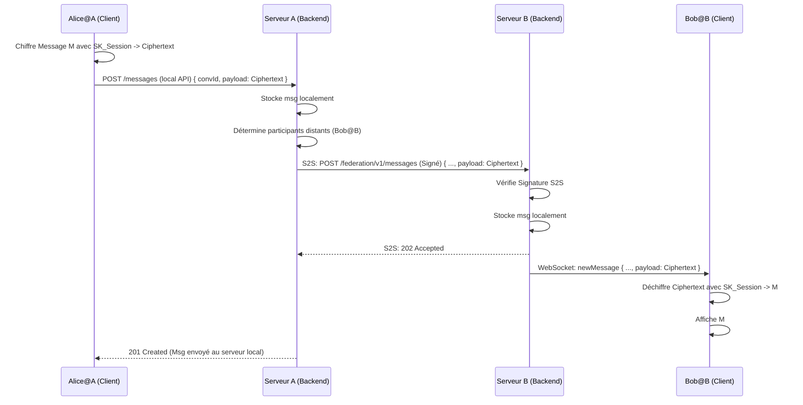

# Plan d'Implémentation : Fédération via Protocole S2S "Maison"

**Objectif :** Permettre aux utilisateurs d'instances différentes de communiquer de manière E2EE, en utilisant une communication directe Server-to-Server (S2S) pour relayer les informations nécessaires (clés publiques, messages chiffrés, gestion des conversations).

**Principes Clés :**

*   **E2EE Maintenu :** Les serveurs ne font que relayer des données déjà chiffrées par les clients ou des clés publiques. Aucune clé privée ou message en clair n'est exposé aux serveurs intermédiaires.
*   **Simplicité :** Définir uniquement les mécanismes S2S strictement nécessaires.
*   **Sécurité S2S :** Mettre l'accent sur l'authentification mutuelle des serveurs et l'intégrité des communications S2S.

---

**1. Identification et Découverte**

*   **Identifiant Utilisateur Fédéré :**
    *   Format : `username@domain.tld` (ex: `alice@instance1.com`, `bob@instance2.org`).
    *   `username` : Unique au sein de son `domain.tld`.
    *   `domain.tld` : Identifie l'instance "home" de l'utilisateur.
*   **Découverte du Serveur Pair :**
    *   **Méthode :** Utilisation des enregistrements DNS SRV.
    *   **Requête DNS :** Le serveur A cherchant à contacter `instance2.org` effectuera une requête SRV pour `_securechat-s2s._tcp.instance2.org`.
    *   **Réponse DNS SRV :** Fournit le nom d'hôte et le port de l'API S2S du serveur `instance2.org`.
    *   **Mise en Cache :** Les serveurs mettront en cache les résultats DNS SRV pour une durée raisonnable (ex: TTL de l'enregistrement) pour améliorer les performances et réduire la charge DNS.
    *   *(Alternative Simplifiée Initiale :* Une table de correspondance statique `domain -> host:port` configurable sur chaque serveur pourrait être utilisée pour les premiers tests avant l'implémentation DNS complète.)

**2. Authentification Server-to-Server (S2S)**

*   **Objectif :** Garantir que lorsqu'un serveur A contacte un serveur B, B puisse vérifier que la requête provient bien de A, et vice-versa. Empêcher l'usurpation d'identité de serveur.
*   **Méthode Choisie : Signature des Requêtes Applicatives**
    1.  **Clés S2S :** Chaque instance de serveur génère et conserve une paire de clés asymétriques (ex: Ed25519) dédiée *uniquement* à la fédération S2S.
    2.  **Publication Clé Publique S2S :** Chaque serveur publie sa clé publique S2S via un mécanisme découvrable, par exemple :
        *   Un enregistrement DNS TXT spécifique (ex: `_securechat-s2s-key.instance1.com`).
        *   Un endpoint public standardisé sur le serveur lui-même (ex: `https://instance1.com/.well-known/securechat-federation-key`).
    3.  **Processus de Signature (Serveur A -> Serveur B) :**
        *   A prépare sa requête HTTP (méthode, path, corps, timestamp).
        *   A crée une chaîne canonique à partir des éléments clés de la requête.
        *   A signe cette chaîne canonique avec sa clé privée S2S.
        *   A ajoute la signature dans un en-tête HTTP personnalisé (ex: `X-Federation-Signature: keyId="instance1.com",signature="base64(signature)"`). L'en-tête inclut l'identifiant du domaine émetteur.
    4.  **Processus de Vérification (Serveur B reçoit de A) :**
        *   B extrait l'identifiant du domaine (`instance1.com`) de l'en-tête `X-Federation-Signature`.
        *   B récupère la clé publique S2S de `instance1.com` (via DNS TXT ou `.well-known`, avec mise en cache).
        *   B reconstruit la chaîne canonique à partir de la requête reçue (en utilisant les mêmes règles que A).
        *   B vérifie la signature reçue en utilisant la chaîne reconstruite et la clé publique S2S de A.
        *   Si la signature est valide et le timestamp inclus dans les données signées est récent (pour éviter le rejeu), la requête est considérée comme authentique.
*   **Transport Sécurisé :** Toute communication S2S **doit** s'effectuer sur HTTPS/TLS pour assurer la confidentialité et l'intégrité de base du transport. La signature applicative ajoute une couche d'authentification forte de l'origine.

**3. API S2S (Protocole "Maison")**

*   **Préfixe :** `/federation/v1` (accessible sur le host/port découvert via DNS SRV).
*   **Format :** Requêtes/Réponses en JSON.
*   **Authentification :** Toutes les requêtes doivent inclure l'en-tête `X-Federation-Signature` valide.

*   **Endpoints Essentiels :**
    *   **`GET /users/{userId}/public_key`**
        *   **Rôle :** Permet à un serveur de récupérer la clé publique d'identité (celle utilisée pour E2EE) d'un utilisateur hébergé sur un serveur distant.
        *   **Paramètre `userId` :** Identifiant complet (`username@domain.tld`). Le serveur contacté vérifie que le `domain.tld` correspond au sien.
        *   **Réponse (200 OK) :** `{ "publicKey": "base64(PK_User)" }`
    *   **`POST /messages`**
        *   **Rôle :** Permet à un serveur A de pousser un message E2EE (chiffré par le client Alice@A) vers le serveur B pour livraison à Bob@B.
        *   **Request Body :** `{ "conversationId": "...", "senderId": "alice@instance1.com", "recipientServerDomain": "instance2.org", "payload": { "nonce": "...", "ciphertext": "...", "authTag": "...", "associatedData": {...} }, "timestamp": "..." }` (Le `payload` est le message chiffré par le client).
        *   **Action Serveur B :** Vérifie signature S2S, vérifie `recipientServerDomain`, stocke le message chiffré, et notifie le client Bob@B via WebSocket.
        *   **Réponse (202 Accepted) :** Message reçu et mis en file d'attente pour livraison.
    *   **`POST /conversations`**
        *   **Rôle :** Permet au serveur de l'initiateur (A) d'informer les serveurs des participants distants (B) de la création d'une conversation ou de l'ajout d'un participant.
        *   **Request Body :** `{ "conversationId": "...", "action": "create" | "add_participant", "initiatorId": "alice@instance1.com", "participantsToAdd": [ { "userId": "bob@instance2.org", "encryptedSessionKey": "base64(EncSK_Bob)" } ], "allParticipants": ["alice@instance1.com", "bob@instance2.org", ...], "timestamp": "..." }` (Contient la clé de session chiffrée *spécifiquement* pour les utilisateurs hébergés sur le serveur B).
        *   **Action Serveur B :** Vérifie signature S2S, crée/met à jour la conversation localement, stocke `encryptedSessionKey` pour ses utilisateurs locaux, notifie ses clients locaux.
        *   **Réponse (201 Created / 200 OK) :** Action traitée.
    *   **`PUT /conversations/{conversationId}/session_key`**
        *   **Rôle :** Gérer la rotation de clé de session lors du retrait d'un participant. Le serveur de l'initiateur de la rotation notifie les serveurs des participants restants.
        *   **Request Body :** Similaire à `POST /conversations`, mais avec `action: "rotate_key"` et la nouvelle clé chiffrée pour les participants restants sur ce serveur.

**4. Modifications Backend (FastAPI)**

*   **Dépendances :** Ajouter `dnspython` (pour DNS SRV/TXT), `cryptography` (si non déjà utilisé pour Ed25519 S2S).
*   **Configuration :** Ajouter des paramètres pour le domaine du serveur, le chemin vers la clé privée S2S, potentiellement une liste blanche de domaines fédérés autorisés au début.
*   **Gestion Clés S2S :** Script ou commande pour générer la paire de clés S2S.
*   **Nouveau Routeur S2S :** Créer `backend/app/api/federation.py` pour les endpoints `/federation/v1`.
*   **Middleware/Dépendance d'Authentification S2S :** Créer une dépendance FastAPI qui gère la vérification de l'en-tête `X-Federation-Signature` (récupération clé publique distante, vérification signature, vérification timestamp).
*   **Client S2S :** Créer un service/classe `FederationClient` responsable de :
    *   La découverte DNS SRV/TXT.
    *   La mise en cache des adresses et clés publiques S2S distantes.
    *   La signature des requêtes sortantes.
    *   L'envoi des requêtes HTTP aux serveurs pairs.
*   **Modèles de Données :**
    *   Adapter les modèles (SQLAlchemy/Pydantic) pour stocker/gérer les identifiants complets `username@domain`.
    *   Potentiellement une table pour suivre l'état des serveurs fédérés connus.
*   **Logique Métier :**
    *   Modifier la logique de création/gestion des conversations et messages pour détecter les participants distants.
    *   Si un participant est distant, appeler le `FederationClient` pour envoyer les requêtes S2S appropriées (après les opérations locales).
    *   Gérer la réception des requêtes S2S via le nouveau routeur et mettre à jour l'état local/notifier les clients locaux.

**5. Modifications Frontend (Nuxt)**

*   **Gestion des Identifiants :**
    *   Permettre la saisie et l'affichage des identifiants complets (`user@domain`) dans l'UI (champs de recherche, liste de participants, création de conversation).
    *   Les stores Pinia (`auth`, `conversations`, `messages`) devront stocker et manipuler ces identifiants complets.
*   **Logique Crypto :** Aucune modification majeure attendue. La cryptographie E2EE reste entièrement côté client et opère sur les clés et les messages, indépendamment de la localisation de l'autre participant.
*   **Appels API Backend :** Le frontend continue d'appeler son propre backend local comme avant. C'est le backend qui gère la complexité de la fédération de manière transparente pour le client. (Ex: `POST /conversations` au backend local déclenchera des appels S2S si des participants distants sont inclus).

**6. Diagramme de Flux Simplifié (Envoi Message Alice@A -> Bob@B)**

**7. Prochaines Étapes Immédiates (Suggestion)**

1.  **Valider ce Plan :** Confirmé.
2.  **Écrire le Plan :** Fait.
3.  **Passer à l'Implémentation :** Suggérer de passer en mode `code` pour commencer l'implémentation étape par étape.