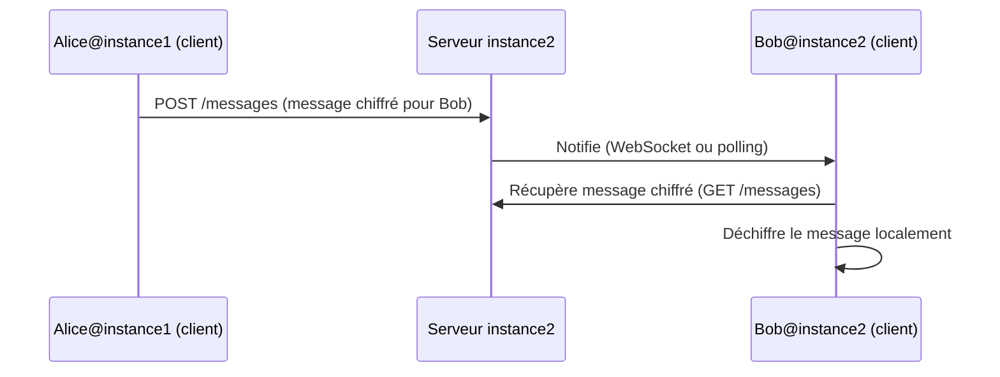
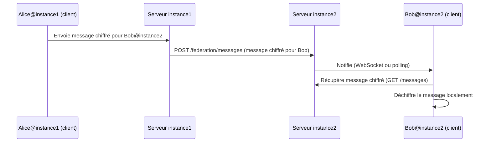

# Planification et Spécifications de la Fédération E2EE

## Objectif

Synthèse structurée des options techniques envisagées pour la fédération dans le projet de messagerie chiffrée de bout en bout (E2EE), avec pour contexte :
- Fédération ouverte (n’importe qui peut déployer une instance)
- Découverte manuelle des utilisateurs distants
- Priorité à la confidentialité des métadonnées

---

## 1. Options Techniques de Fédération

### 1.1. Relais direct inter-instances (S2S classique, type Matrix/XMPP)

**Principe :**  
Chaque serveur relaie les messages chiffrés entre instances via une API S2S. Les messages E2EE sont transmis de serveur à serveur, chaque instance stockant et relayant les messages pour ses utilisateurs locaux.

**Niveau de spécification atteint :**
- Principe général et flux décrits
- Avantages : modèle éprouvé, livraison asynchrone, gestion centralisée des files d’attente
- Inconvénients : exposition des métadonnées à tous les serveurs intermédiaires, complexité S2S, risque accru en cas de compromission d’une instance
- Maintien de l’E2EE : oui, mais métadonnées exposées
- **Zone d’ombre :** Non détaillé pour l’API, la gestion des contacts, ni les mécanismes anti-abus

---

### 1.2. Relais indirect via clients (store-and-forward pur E2EE, type Signal Federation)

**Principe :**  
Les clients déposent directement les messages chiffrés sur le serveur du destinataire, sans relai S2S. Le serveur local ne stocke que les messages pour ses propres utilisateurs.

**Niveau de spécification atteint :**
- Principe général et flux détaillés (voir schéma séquentiel)
- Avantages : confidentialité maximale des métadonnées, E2EE strict
- Inconvénients : dépendance à la connectivité du client expéditeur, gestion des erreurs réseau et des files d’attente côté client, notifications plus complexes
- Implications UX détaillées : gestion des messages en attente, découverte manuelle de l’API distante, gestion des doublons, sécurité TLS
- Plan d’implémentation synthétique proposé
- **Zone d’ombre :** Non spécifié : format exact de l’API distante, gestion de la file d’attente locale (persistance, chiffrement), gestion des accusés de réception

---

### 1.3. Passerelle “dropbox” inter-instances (API REST minimale)

**Principe :**  
Chaque instance expose une API REST fédérée permettant à d’autres instances de déposer des messages chiffrés pour ses utilisateurs locaux. Pas de S2S permanent, juste un dépôt ponctuel.

**Niveau de spécification atteint :**
- Principe général et flux illustrés (voir schéma séquentiel)
- Spécification d’API REST minimale proposée (POST /federation/messages, GET /messages)
- Avantages : simplicité d’implémentation, E2EE maintenu, métadonnées exposées uniquement à l’instance destinataire
- Inconvénients : gestion manuelle des contacts, pas de notification “push” native, métadonnées de dépôt visibles par l’instance cible
- Points de vigilance : protection contre l’abus, documentation des identifiants, gestion des erreurs réseau
- Plan d’implémentation synthétique proposé
- **Zone d’ombre :** Authentification inter-instances (clé API, signature ?), gestion des doublons, format exact des notifications

---

## 2. Comparatif synthétique

| Option                                   | E2EE | Confidentialité métadonnées | Complexité | Robustesse offline | Spécification atteinte |
|-------------------------------------------|:----:|:--------------------------:|:----------:|:------------------:|:----------------------:|
| 1. S2S direct (Matrix/XMPP)               |  Oui |           Faible           |   Élevée   |      Bonne         |   Principes, limites   |
| 2. Relai client (Signal-like)             |  Oui |          Excellente        |  Moyenne   |    Moyenne-        |   Flux, UX, plan       |
| 3. Dropbox REST inter-instances           |  Oui |          Très bonne        |   Faible   |      Bonne         |   API, plan, limites   |

---

## 3. Points clés et questions en suspens

### 3.1. Points clés

- **Confidentialité des métadonnées :**  
  Les options 2 et 3 limitent l’exposition des métadonnées à l’instance destinataire uniquement.
- **Découverte manuelle :**  
  Toutes les options supposent que l’utilisateur saisit explicitement l’identifiant distant (ex : bob@instance2.tld).
- **E2EE strict :**  
  Maintenu dans toutes les options, le serveur ne voit jamais le contenu en clair.

### 3.2. Zones d’ombre / Questions en suspens

- **Authentification inter-instances :**  
  Faut-il exiger une signature ou une clé API pour POST /federation/messages ? (option 3)
- **Gestion des files d’attente côté client :**  
  Pour l’option 2, comment persister et chiffrer la file d’attente locale ? (IndexedDB, mémoire, autre ?)
- **Gestion des accusés de réception et des doublons :**  
  Comment garantir la non-perte et l’unicité des messages dans les deux modèles ?
- **Notifications inter-instances :**  
  Faut-il prévoir un mécanisme de notification “push” fédéré ?
- **UX :**  
  Comment informer l’utilisateur de l’état réel de ses messages (envoyé, en attente, erreur) ?

---

## 4. Schémas de flux (extraits)

### 4.1. Relai client (option 2)

### 4.2. Dropbox REST (option 3)

---

## 5. Prochaines étapes

- Préciser les choix d’architecture (option 2 ou 3 ?)
- Spécifier les API et les formats de payloads pour l’option retenue
- Définir la gestion des files d’attente et des notifications
- Documenter les exigences de sécurité inter-instances
- Prototyper l’interopérabilité entre deux instances